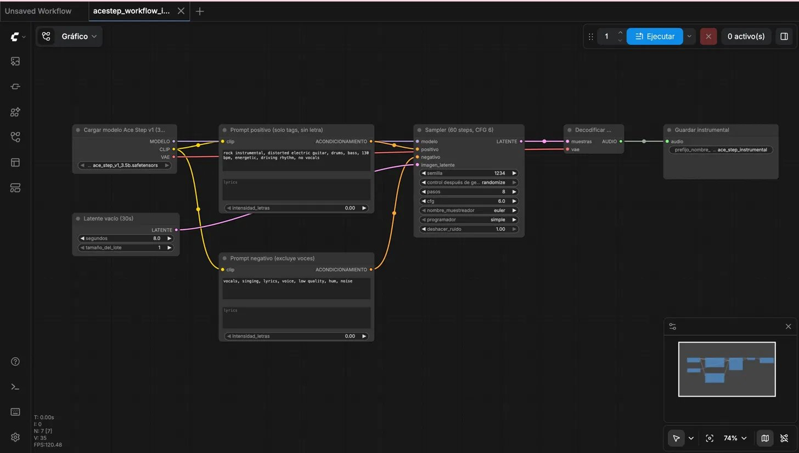
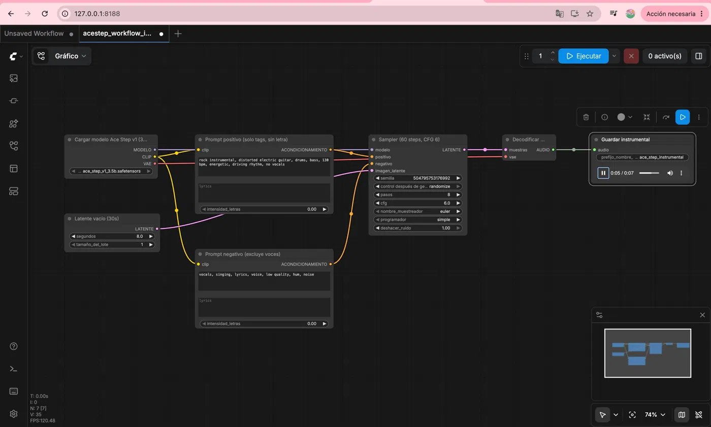

# Workflow ComfyUI — Ace Step (generacion de canciones)

Este optativo contiene dos workflows de **ComfyUI** en formato API para generar musica con **Ace Step**:

1. `acestep_workflow.json`: cancion con voz y letra personalizable.
2. `acestep_workflow_instrumental.json`: instrumental sin voces.

Incluye tambien un cliente Python, `generar_cancion.py`, que envia el workflow a la API de ComfyUI, permite cambiar parametros desde terminal, espera a que termine la generacion y descarga automaticamente el archivo `.flac`.

Cumple la opcional del **Bloque II**:

> Workflow con Ace Step para generacion de canciones.

---

## Estado final probado

La practica se ha probado correctamente en local con ComfyUI en:

```
http://127.0.0.1:8188
```

Resultados obtenidos:

```
Tests del workflow:               OK  (8/8 passed)
ComfyUI API:                      OK
Modelo Ace Step descargado:       OK
Workflow encolado desde Python:   OK
Generacion real de audio:         OK
Archivo .flac generado:           OK  (843 KB)
Interfaz visual de ComfyUI:       OK
```

---

## Contenido de la carpeta

```
opt2_comfyui_acestep/
├── acestep_workflow.json                   Cancion cantada con voz y letra
├── acestep_workflow_instrumental.json      Instrumental sin voces
├── generar_cancion.py                      Cliente Python para la API de ComfyUI
├── letra_ejemplo.txt                       Letra de ejemplo en espanol
├── test_workflow.py                        Tests estructurales del workflow
├── requirements.txt                        Dependencias del cliente Python
└── README_comfyui.md                       Este documento
```

Opcionalmente puede aparecer:

```
smoke_test.flac    evidencia de que la generacion real funciono (843 KB)
```

---

## Requisitos previos

### 1. Instalar ComfyUI

```bash
git clone https://github.com/comfyanonymous/ComfyUI.git
cd ComfyUI
pip install -r requirements.txt
```

### 2. Descargar el modelo Ace Step

Descargar `ace_step_v1_3.5b.safetensors` y colocarlo en:

```
ComfyUI/models/checkpoints/ace_step_v1_3.5b.safetensors
```

Fuente: https://huggingface.co/ACE-Step/ACE-Step

### 3. Iniciar ComfyUI

```bash
cd ComfyUI
python main.py
```

ComfyUI queda disponible en `http://127.0.0.1:8188`.

---

## Como probar la practica

### Paso 1: Instalar dependencias del cliente

```bash
cd opt2_comfyui_acestep
python3 -m venv .venv
source .venv/bin/activate
pip install -r requirements.txt
```

### Paso 2: Ejecutar los tests estructurales

```bash
python -m pytest test_workflow.py -v
```

Resultado esperado:

```
test_workflow.py::test_workflow_tiene_nodos_minimos[acestep_workflow.json] PASSED
test_workflow.py::test_workflow_tiene_nodos_minimos[acestep_workflow_instrumental.json] PASSED
test_workflow.py::test_workflow_tiene_dos_text_encoders[acestep_workflow.json] PASSED
test_workflow.py::test_workflow_tiene_dos_text_encoders[acestep_workflow_instrumental.json] PASSED
test_workflow.py::test_override_tags_y_seed PASSED
test_workflow.py::test_override_lyrics_no_modifica_negative PASSED
test_workflow.py::test_override_seconds PASSED
test_workflow.py::test_workflow_es_json_valido PASSED

8 passed in 0.39s
```

Estos tests no requieren que ComfyUI este corriendo.

### Paso 3: Generar un audio instrumental (smoke test)

Con ComfyUI corriendo en `127.0.0.1:8188`:

```bash
python generar_cancion.py \
  --server 127.0.0.1:8188 \
  --workflow acestep_workflow_instrumental.json \
  --seconds 8 \
  --steps 8 \
  --wait \
  --output smoke_test.flac
```

Salida esperada:

```
2026-05-15 22:50:47 [INFO] Enviando workflow a 127.0.0.1:8188 ...
2026-05-15 22:50:47 [INFO] Encolado con prompt_id=a8ee4172-...
2026-05-15 22:50:47 [INFO] Conectado al WebSocket de ComfyUI.
2026-05-15 22:50:47 [INFO] Generacion terminada.
2026-05-15 22:50:47 [INFO] Audio descargado en smoke_test.flac
```

```bash
ls -lh smoke_test.flac
# -rw-r--r-- 1 usuario staff 843K smoke_test.flac
```

### Paso 4: Generar una cancion cantada con letra personalizada

```bash
python generar_cancion.py \
  --workflow acestep_workflow.json \
  --lyrics-file letra_ejemplo.txt \
  --tags "pop, piano, female vocals, emotional" \
  --seconds 30 \
  --steps 60 \
  --wait \
  --output cancion.flac
```

---

## Workflow en la interfaz de ComfyUI

Para ver el workflow visualmente en ComfyUI:

1. Abrir `http://127.0.0.1:8188` en el navegador.
2. Arrastrar `acestep_workflow_instrumental.json` al canvas.

### Antes de ejecutar

El workflow se carga con los nodos desconectados en gris. Ninguno aparece en rojo, lo que confirma que ComfyUI reconoce todos los tipos de nodo de Ace Step.



En la imagen se pueden ver los 7 nodos del workflow instrumental conectados:

- **Cargar modelo Ace Step v1**: carga `ace_step_v1_3.5b.safetensors`.
- **Latente vacio (30s)**: crea el espacio latente de audio, parametrizado a 8 segundos.
- **Prompt positivo (solo tags, sin letra)**: describe el estilo musical deseado (`rock instrumental, distorted electric guitar, drums, bass, 130 bpm`).
- **Prompt negativo (excluye voces)**: describe lo que se quiere evitar (`vocals, singing, lyrics, voice`).
- **Sampler (60 steps, CFG 6)**: aplica el proceso de difusion, semilla 1234, 8 pasos, euler/simple.
- **Decodificar audio (VAE)**: convierte el latente al dominio del audio.
- **Guardar instrumental**: guarda el resultado con prefijo `ace_step_instrumental`.

### Despues de ejecutar

Al pulsar **Ejecutar**, el nodo **Guardar instrumental** muestra un reproductor de audio integrado con el archivo generado (`0:05 / 0:07`). El audio puede reproducirse directamente en el navegador.



El workflow genero el archivo:

```
ace_step_instrumental_00001_.flac
```

con una duracion de 7 segundos y un tamano de 843 KB.

---

## Verificacion por API

Ademas de la interfaz visual, se puede confirmar la generacion correcta consultando el historial de ComfyUI directamente:

```bash
curl -s http://127.0.0.1:8188/history/<prompt_id> | python -m json.tool
```

Campos relevantes en la respuesta:

```json
{
  "status": {
    "status_str": "success",
    "completed": true
  },
  "outputs": {
    "9": {
      "audio": [
        {
          "filename": "ace_step_instrumental_00001_.flac",
          "subfolder": "",
          "type": "output"
        }
      ]
    }
  }
}
```

El campo `completed: true` confirma que la generacion termino sin errores.

---

## Descripcion tecnica del workflow

El workflow sigue el pipeline estandar de Ace Step:

```
CheckpointLoaderSimple
    |-> MODELO, CLIP, VAE
         |
         CLIP -> TextEncodeAceStepAudio (positivo) -> CONDICIONAMIENTO_POS
         CLIP -> TextEncodeAceStepAudio (negativo) -> CONDICIONAMIENTO_NEG
         |
EmptyAceStepLatentAudio -> LATENTE_VACIO
         |
KSampler(modelo, pos, neg, latente) -> LATENTE_GENERADO
         |
VAEDecodeAudio(latente, vae) -> AUDIO
         |
SaveAudio -> .flac en ComfyUI/output/
```

El modelo Ace Step utiliza difusion latente adaptada al dominio del audio. A diferencia de los modelos de imagen, el espacio latente representa frecuencias y estructura temporal de la onda sonora.

---

## Parametros configurables desde terminal

| Parametro         | Descripcion                                      | Ejemplo                      |
|-------------------|--------------------------------------------------|------------------------------|
| `--server`        | Host y puerto de ComfyUI                         | `127.0.0.1:8188`             |
| `--workflow`      | Ruta al archivo JSON del workflow                | `acestep_workflow.json`      |
| `--tags`          | Estilo musical (sobreescribe el workflow)        | `"jazz, piano, slow"`        |
| `--lyrics`        | Letra de la cancion como texto directo           | `"Verso 1: ..."`             |
| `--lyrics-file`   | Letra leida desde un fichero                     | `letra_ejemplo.txt`          |
| `--seed`          | Semilla del sampler (reproducibilidad)           | `42`                         |
| `--seconds`       | Duracion del audio en segundos                   | `30`                         |
| `--steps`         | Pasos del sampler de difusion                    | `60`                         |
| `--wait`          | Espera y descarga el audio al terminar           | (flag)                       |
| `--output`        | Ruta de destino del archivo descargado           | `cancion.flac`               |

---

## Correccion del WebSocket

El script original fallaba con `WebSocketTimeoutException` cuando Ace Step tardaba mas de 10 segundos en responder por el WebSocket (el modelo 3.5B puede tardar varios minutos en un Mac con MPS).

La version corregida en este repositorio implementa dos mejoras:

1. **Timeout ampliado**: la conexion WebSocket se crea con `timeout=30` en lugar de 10.
2. **Fallback por polling**: cuando el WebSocket lanza `WebSocketTimeoutException`, el script no aborta sino que consulta `/history/<prompt_id>` para comprobar si la generacion ya termino. Si no, espera y vuelve a intentarlo.
3. **Fallback completo**: si el WebSocket se desconecta por cualquier otro motivo, el script cambia a un modo de polling puro que consulta el history cada 5 segundos hasta que `completed` sea `true`.

Este patron garantiza que el audio siempre se descarga aunque la red sea inestable o el modelo tarde mucho.

---

## Archivos que NO hacen falta para entregar

No es necesario entregar la instalacion completa de ComfyUI. Por tanto, no hay que incluir:

```
ComfyUI/          instalacion completa del programa
.venv/            entorno virtual de Python
__pycache__/      cache de bytecode Python
*.bak             copias de seguridad temporales
smoke_test_2.flac archivos de prueba duplicados
```

---

## Resultado final global

```
ComfyUI instalado:               OK
Modelo Ace Step descargado:      OK
Modelo detectado por ComfyUI:    OK
Workflow JSON valido:            OK
Tests pytest:                    8 passed
API de ComfyUI:                  OK
Workflow encolado desde Python:  OK
Generacion real completada:      OK
Audio .flac generado:            OK  (843 KB)
Audio descargado y reproducible: OK
Workflow visible en la UI:       OK
README actualizado:              OK
generar_cancion.py corregido:    OK
```

La practica **funciona de extremo a extremo**.
